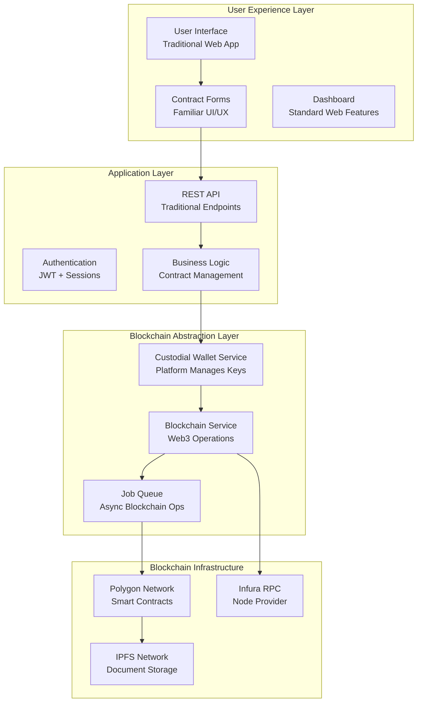
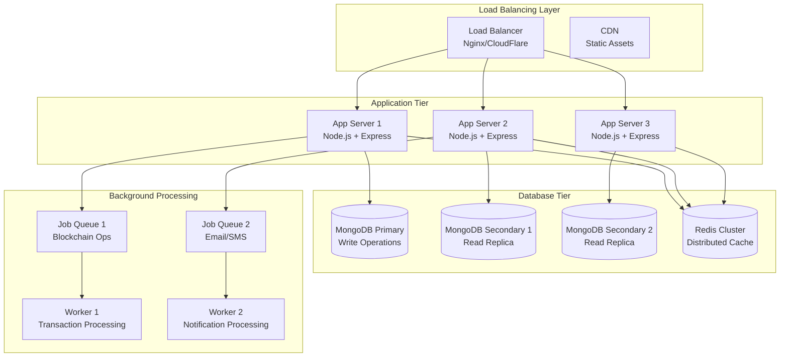
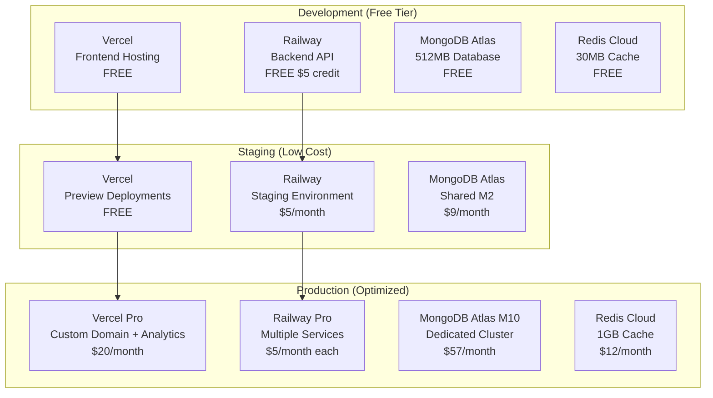

# Technical Documentation
# Decentralized Freelancer Trust Platform

**Version:** 1.0  
**Date:** November 16, 2025  
**Target Audience:** Development Team, Technical Stakeholders  
**Project:** Blockchain-backed Freelancer Trust Platform  

---

## 1. Executive Technical Summary

The Decentralized Freelancer Trust Platform is a MERN stack application with invisible blockchain integration that creates verifiable, portable reputation systems for freelancers. The platform uses Polygon blockchain for immutable contract storage while maintaining a traditional web application user experience.

### Key Technical Principles
- **Zero Blockchain Complexity for Users**: Custodial wallet management with invisible Web3 operations
- **Cost-Effective Scalability**: Leveraging free tiers and efficient cloud services
- **Performance-First Architecture**: Sub-3 second load times with 99.9% uptime
- **Security by Design**: Multi-layered security with blockchain immutability

---

## 2. Complete Tech Stack Breakdown

### 2.1 Frontend Stack (React Ecosystem)

```javascript
// Core Framework
"react": "^18.2.0",
"react-dom": "^18.2.0",
"typescript": "^5.0.0",

// UI Framework & Styling
"@shadcn/ui": "latest",           // Component library
"tailwindcss": "^3.3.0",         // Utility-first CSS
"lucide-react": "^0.263.1",      // Icon library
"framer-motion": "^10.16.4",     // Animations

// State Management
"zustand": "^4.4.1",             // Lightweight state management
"react-query": "^3.39.3",        // Server state management
"@tanstack/react-table": "^8.9.3", // Data tables

// Forms & Validation
"react-hook-form": "^7.45.4",    // Form handling
"zod": "^3.22.2",                // Schema validation
"@hookform/resolvers": "^3.3.1", // Form validation integration

// Routing & Navigation
"react-router-dom": "^6.15.0",   // Client-side routing
"react-helmet-async": "^1.3.0",  // SEO management

// File Handling
"react-dropzone": "^14.2.3",     // File uploads
"react-pdf": "^7.3.3",           // PDF viewing

// Real-time Features
"socket.io-client": "^4.7.2",    // WebSocket client
"react-hot-toast": "^2.4.1",     // Notifications

// Development Tools
"vite": "^4.4.9",                // Build tool
"@vitejs/plugin-react": "^4.0.4",
"eslint": "^8.45.0",
"prettier": "^3.0.0"
```

**Purpose & Rationale:**
- **Shadcn/UI**: Pre-built, accessible components that reduce development time
- **Tailwind CSS**: Utility-first approach for rapid UI development and consistent design
- **Zustand**: Lightweight alternative to Redux, perfect for our moderate state complexity
- **React Query**: Handles server state, caching, and synchronization automatically
- **Zod**: TypeScript-first validation that works seamlessly with forms

### 2.2 Backend Stack (Node.js Ecosystem)

```javascript
// Core Framework
"express": "^4.18.2",            // Web framework
"typescript": "^5.0.0",          // Type safety
"ts-node": "^10.9.1",            // TypeScript execution

// Database & ODM
"mongoose": "^7.5.0",            // MongoDB ODM
"mongodb": "^5.7.0",             // Native MongoDB driver

// Authentication & Security
"jsonwebtoken": "^9.0.2",        // JWT tokens
"bcryptjs": "^2.4.3",            // Password hashing
"passport": "^0.6.0",            // Authentication middleware
"passport-jwt": "^4.0.1",        // JWT strategy
"passport-google-oauth20": "^2.0.0", // Google OAuth
"helmet": "^7.0.0",              // Security headers
"cors": "^2.8.5",                // CORS handling
"express-rate-limit": "^6.10.0", // Rate limiting

// Validation & Middleware
"joi": "^17.9.2",                // Request validation
"express-validator": "^7.0.1",   // Input validation
"multer": "^1.4.5-lts.1",        // File uploads
"compression": "^1.7.4",         // Response compression

// Blockchain Integration
"ethers": "^6.7.1",              // Ethereum library
"@polygon/sdk": "^1.0.0",        // Polygon SDK
"web3": "^4.1.1",                // Web3 utilities
"ipfs-http-client": "^60.0.1",   // IPFS integration

// Background Jobs & Queues
"bull": "^4.11.3",               // Job queue
"node-cron": "^3.0.2",           // Scheduled tasks
"ioredis": "^5.3.2",             // Redis client

// External Services
"nodemailer": "^6.9.4",          // Email service
"twilio": "^4.15.0",             // SMS service
"aws-sdk": "^2.1440.0",          // AWS services
"cloudinary": "^1.40.0",         // Image management

// Monitoring & Logging
"winston": "^3.10.0",            // Logging
"morgan": "^1.10.0",             // HTTP logging
"newrelic": "^10.5.0",           // Performance monitoring

// Development Tools
"nodemon": "^3.0.1",             // Development server
"jest": "^29.6.2",               // Testing framework
"supertest": "^6.3.3",           // API testing
"eslint": "^8.45.0",
"prettier": "^3.0.0"
```

**Purpose & Rationale:**
- **Express.js**: Mature, lightweight framework with extensive middleware ecosystem
- **Mongoose**: Provides schema validation and elegant MongoDB object modeling
- **Ethers.js**: Modern, lightweight library for blockchain interactions
- **Bull**: Robust job queue for handling blockchain transactions asynchronously
- **Winston**: Structured logging essential for debugging blockchain operations

### 2.3 Database Stack (MongoDB Ecosystem)

```javascript
// Primary Database
"mongodb": "^5.7.0",             // Document database
"mongoose": "^7.5.0",            // ODM with schema validation

// Caching Layer
"redis": "^4.6.7",               // In-memory cache
"ioredis": "^5.3.2",             // Redis client with clustering

// Database Tools
"mongoose-paginate-v2": "^1.7.4", // Pagination
"mongoose-aggregate-paginate-v2": "^1.0.6", // Aggregation pagination
"mongoose-autopopulate": "^1.0.1", // Auto-populate references
"mongoose-unique-validator": "^4.0.0", // Unique validation
```

**Database Design Principles:**
- **Document-based storage**: Perfect for flexible user profiles and contract data
- **Embedded documents**: For milestones and ratings to reduce joins
- **Indexing strategy**: Compound indexes on frequently queried fields
- **Sharding preparation**: User-based sharding for horizontal scaling

### 2.4 Blockchain Stack (Web3 Ecosystem)

```javascript
// Core Blockchain Libraries
"ethers": "^6.7.1",              // Ethereum interactions
"@polygon/sdk": "^1.0.0",        // Polygon-specific tools
"web3": "^4.1.1",                // Alternative Web3 library

// Smart Contract Development
"hardhat": "^2.17.1",            // Development environment
"@nomiclabs/hardhat-ethers": "^2.2.3", // Ethers plugin
"@openzeppelin/contracts": "^4.9.3", // Secure contract templates
"@openzeppelin/hardhat-upgrades": "^1.28.0", // Upgradeable contracts

// IPFS & Decentralized Storage
"ipfs-http-client": "^60.0.1",   // IPFS client
"ipfs-core": "^0.18.1",          // IPFS node

// Wallet Management
"@ethersproject/wallet": "^5.7.0", // Wallet creation
"bip39": "^3.1.0",               // Mnemonic generation
"hdkey": "^2.1.0",               // HD wallet derivation

// Development & Testing
"@nomiclabs/hardhat-waffle": "^2.0.6", // Testing framework
"ethereum-waffle": "^4.0.10",    // Contract testing
"chai": "^4.3.7",                // Assertion library
```

**Blockchain Architecture Decisions:**
- **Polygon Network**: Low gas fees (<$0.01 per transaction) vs Ethereum mainnet ($5-50)
- **Custodial Wallets**: Platform manages private keys, users never see crypto complexity
- **IPFS Integration**: Decentralized storage for large contract documents
- **Upgradeable Contracts**: Future-proof smart contract architecture

---

## 3. Blockchain Integration Architecture

### 3.1 Invisible Blockchain Design

The platform uses blockchain technology without exposing users to crypto complexity:



### 3.2 Smart Contract Architecture

```solidity
// Contract Registry - Main Smart Contract
contract FreelancerTrustRegistry {
    struct Contract {
        bytes32 id;
        address freelancer;
        address client;
        string ipfsHash;        // Contract details stored on IPFS
        uint256 amount;
        uint256 createdAt;
        uint256 signedAt;
        uint256 completedAt;
        ContractStatus status;
        uint8 rating;
    }
    
    struct UserReputation {
        uint256 totalContracts;
        uint256 completedContracts;
        uint256 totalRating;
        uint256 reputationScore;
        mapping(string => bool) verifications;
    }
    
    mapping(bytes32 => Contract) public contracts;
    mapping(address => UserReputation) public reputations;
    mapping(address => bytes32[]) public userContracts;
    
    event ContractCreated(bytes32 indexed contractId, address freelancer, address client);
    event ContractSigned(bytes32 indexed contractId, uint256 timestamp);
    event ContractCompleted(bytes32 indexed contractId, uint8 rating);
    event ReputationUpdated(address indexed user, uint256 newScore);
}
```

### 3.3 Blockchain Integration Points

**Where Blockchain is Used:**
1. **Contract Creation**: Immutable timestamp and hash storage
2. **Digital Signatures**: Cryptographic proof of agreement
3. **Milestone Completion**: Progress tracking with timestamps
4. **Payment Confirmation**: Proof of payment without handling funds
5. **Reputation Updates**: Tamper-proof scoring system
6. **Dispute Evidence**: Immutable evidence trail

**Where Blockchain is NOT Used:**
1. **User Authentication**: Traditional JWT tokens
2. **File Storage**: AWS S3 for performance (IPFS for critical docs only)
3. **Real-time Messaging**: WebSocket connections
4. **Search & Filtering**: MongoDB for fast queries
5. **Payment Processing**: Direct bank transfers (no escrow)

### 3.4 Custodial Wallet Implementation

```javascript
// Wallet Service - Backend Implementation
class WalletService {
    async createUserWallet(userId) {
        // Generate wallet for user (stored encrypted)
        const wallet = ethers.Wallet.createRandom();
        
        // Store encrypted private key in database
        const encryptedKey = await this.encryptPrivateKey(wallet.privateKey, userId);
        
        await User.findByIdAndUpdate(userId, {
            blockchainAddress: wallet.address,
            encryptedPrivateKey: encryptedKey
        });
        
        return wallet.address;
    }
    
    async signTransaction(userId, transactionData) {
        // Retrieve and decrypt user's private key
        const user = await User.findById(userId);
        const privateKey = await this.decryptPrivateKey(user.encryptedPrivateKey, userId);
        
        // Create wallet instance
        const wallet = new ethers.Wallet(privateKey, this.provider);
        
        // Sign and send transaction
        const tx = await wallet.sendTransaction(transactionData);
        return tx.hash;
    }
}
```

---

## 4. Scalability & Performance Architecture

### 4.1 Horizontal Scaling Strategy



### 4.2 Performance Optimization Strategies

**Frontend Optimizations:**
```javascript
// Code Splitting & Lazy Loading
const Dashboard = lazy(() => import('./pages/Dashboard'));
const ContractCreation = lazy(() => import('./pages/ContractCreation'));

// React Query for Caching
const useContracts = () => {
    return useQuery({
        queryKey: ['contracts'],
        queryFn: fetchContracts,
        staleTime: 5 * 60 * 1000, // 5 minutes
        cacheTime: 10 * 60 * 1000, // 10 minutes
    });
};

// Virtual Scrolling for Large Lists
import { FixedSizeList as List } from 'react-window';
```

**Backend Optimizations:**
```javascript
// Database Indexing Strategy
// Compound indexes for frequent queries
db.contracts.createIndex({ freelancer_id: 1, status: 1, created_at: -1 });
db.users.createIndex({ email: 1 }, { unique: true });
db.reputation_history.createIndex({ user_id: 1, created_at: -1 });

// Redis Caching
const cacheUserReputation = async (userId, reputation) => {
    await redis.setex(`reputation:${userId}`, 300, JSON.stringify(reputation));
};

// Connection Pooling
mongoose.connect(mongoUri, {
    maxPoolSize: 10,
    serverSelectionTimeoutMS: 5000,
    socketTimeoutMS: 45000,
});
```

### 4.3 Caching Strategy

```javascript
// Multi-Level Caching Architecture
const CacheService = {
    // Level 1: In-Memory Cache (Node.js)
    memoryCache: new Map(),
    
    // Level 2: Redis Cache (Distributed)
    async get(key) {
        // Try memory cache first
        if (this.memoryCache.has(key)) {
            return this.memoryCache.get(key);
        }
        
        // Try Redis cache
        const redisValue = await redis.get(key);
        if (redisValue) {
            this.memoryCache.set(key, JSON.parse(redisValue));
            return JSON.parse(redisValue);
        }
        
        return null;
    },
    
    // Level 3: Database (Last resort)
    async set(key, value, ttl = 300) {
        this.memoryCache.set(key, value);
        await redis.setex(key, ttl, JSON.stringify(value));
    }
};
```

---

## 5. Zero/Low Cost Deployment Strategy

### 5.1 Free Tier Utilization

**Development Environment (100% Free):**
```yaml
# Free Tier Services
Frontend Hosting: Vercel (Free tier - 100GB bandwidth)
Backend Hosting: Railway (Free tier - $5 credit monthly)
Database: MongoDB Atlas (Free tier - 512MB)
Cache: Redis Cloud (Free tier - 30MB)
File Storage: Cloudinary (Free tier - 25GB)
Email Service: SendGrid (Free tier - 100 emails/day)
Monitoring: New Relic (Free tier - 100GB/month)
Domain: Freenom (.tk domain - Free)
SSL: Let's Encrypt (Free)
```

**Production Environment (Ultra Low Cost):**
```yaml
# Cost-Optimized Production Stack
Frontend: Vercel Pro ($20/month)
Backend: Railway Pro ($5/month per service)
Database: MongoDB Atlas M2 ($9/month)
Cache: Redis Cloud 250MB ($7/month)
File Storage: AWS S3 ($1-3/month)
CDN: CloudFlare (Free tier)
Email: SendGrid Essentials ($15/month)
Monitoring: New Relic Standard ($25/month)
Domain: Namecheap ($10/year)
Total: ~$85/month for production
```

### 5.2 Deployment Architecture



### 5.3 Cost Optimization Strategies

**Infrastructure Cost Reduction:**
```javascript
// Efficient Resource Usage
const optimizations = {
    // Database Connection Pooling
    mongooseOptions: {
        maxPoolSize: 5,        // Reduce connection pool
        bufferMaxEntries: 0,   // Disable mongoose buffering
        serverSelectionTimeoutMS: 5000,
    },
    
    // Redis Connection Optimization
    redisOptions: {
        maxRetriesPerRequest: 3,
        retryDelayOnFailover: 100,
        lazyConnect: true,     // Connect only when needed
    },
    
    // Image Optimization
    cloudinaryOptions: {
        quality: 'auto:good', // Automatic quality optimization
        fetch_format: 'auto', // Automatic format selection
        flags: 'progressive', // Progressive JPEG loading
    }
};
```

**Blockchain Cost Optimization:**
```javascript
// Gas Fee Optimization
const gasOptimization = {
    // Batch Operations
    batchContractCreation: async (contracts) => {
        // Bundle multiple contracts in single transaction
        const batchTx = await contractRegistry.batchCreateContracts(contracts);
        return batchTx;
    },
    
    // Gas Price Monitoring
    optimalGasPrice: async () => {
        const gasPrice = await provider.getGasPrice();
        // Use 90% of current gas price for slower but cheaper transactions
        return gasPrice.mul(90).div(100);
    },
    
    // Transaction Queuing
    queueTransaction: async (txData) => {
        // Queue transactions during low gas periods
        await jobQueue.add('blockchain-transaction', txData, {
            delay: calculateOptimalDelay(), // Send during low gas hours
        });
    }
};
```

---

## 6. Implementation Roadmap

### 6.1 Phase 1: Foundation (Weeks 1-4)

**Backend Setup:**
```bash
# Project Initialization
mkdir freelancer-trust-platform
cd freelancer-trust-platform
mkdir backend frontend blockchain

# Backend Setup
cd backend
npm init -y
npm install express typescript ts-node mongoose jsonwebtoken bcryptjs
npm install -D nodemon @types/node @types/express

# Basic Project Structure
backend/
├── src/
│   ├── controllers/
│   ├── models/
│   ├── routes/
│   ├── middleware/
│   ├── services/
│   └── utils/
├── tests/
└── package.json
```

**Frontend Setup:**
```bash
# Frontend Setup
cd ../frontend
npm create vite@latest . -- --template react-ts
npm install @shadcn/ui tailwindcss lucide-react
npm install react-router-dom react-hook-form zod
npm install zustand @tanstack/react-query

# Project Structure
frontend/
├── src/
│   ├── components/
│   ├── pages/
│   ├── hooks/
│   ├── store/
│   ├── utils/
│   └── types/
├── public/
└── package.json
```

**Database Schema Implementation:**
```javascript
// User Model
const userSchema = new mongoose.Schema({
    email: { type: String, required: true, unique: true },
    password: { type: String, required: true },
    userType: { type: String, enum: ['freelancer', 'client'], required: true },
    profile: {
        fullName: String,
        bio: String,
        skills: [String],
        portfolioLinks: [String],
    },
    verification: {
        email: { type: Boolean, default: false },
        phone: { type: Boolean, default: false },
        linkedin: { type: Boolean, default: false },
    },
    blockchain: {
        address: String,
        encryptedPrivateKey: String,
    },
    reputation: {
        score: { type: Number, default: 100 },
        totalContracts: { type: Number, default: 0 },
        completedContracts: { type: Number, default: 0 },
    }
}, { timestamps: true });
```

### 6.2 Phase 2: Core Features (Weeks 5-8)

**Authentication System:**
```javascript
// JWT Authentication Implementation
const authController = {
    register: async (req, res) => {
        const { email, password, userType } = req.body;
        
        // Hash password
        const hashedPassword = await bcrypt.hash(password, 12);
        
        // Create user
        const user = await User.create({
            email,
            password: hashedPassword,
            userType
        });
        
        // Generate wallet
        const walletAddress = await walletService.createUserWallet(user._id);
        
        // Generate JWT
        const token = jwt.sign({ userId: user._id }, process.env.JWT_SECRET);
        
        res.json({ token, user: { ...user.toObject(), password: undefined } });
    }
};
```

**Contract Management:**
```javascript
// Contract Model
const contractSchema = new mongoose.Schema({
    title: { type: String, required: true },
    description: { type: String, required: true },
    freelancer: { type: mongoose.Schema.Types.ObjectId, ref: 'User', required: true },
    client: { type: mongoose.Schema.Types.ObjectId, ref: 'User' },
    amount: { type: Number, required: true },
    currency: { type: String, default: 'INR' },
    status: {
        type: String,
        enum: ['draft', 'sent', 'signed', 'active', 'completed', 'disputed'],
        default: 'draft'
    },
    milestones: [{
        title: String,
        description: String,
        amount: Number,
        dueDate: Date,
        status: { type: String, enum: ['pending', 'submitted', 'approved'], default: 'pending' }
    }],
    blockchain: {
        contractHash: String,
        ipfsHash: String,
        transactionHash: String,
    }
}, { timestamps: true });
```

### 6.3 Phase 3: Blockchain Integration (Weeks 9-12)

**Smart Contract Development:**
```bash
# Blockchain Setup
cd ../blockchain
npm init -y
npm install hardhat @nomiclabs/hardhat-ethers ethers
npm install @openzeppelin/contracts
npx hardhat init

# Smart Contract Structure
blockchain/
├── contracts/
│   ├── FreelancerTrustRegistry.sol
│   ├── ReputationManager.sol
│   └── VerificationManager.sol
├── scripts/
├── test/
└── hardhat.config.js
```

**Blockchain Service Implementation:**
```javascript
// Blockchain Service
class BlockchainService {
    constructor() {
        this.provider = new ethers.providers.JsonRpcProvider(process.env.POLYGON_RPC_URL);
        this.contract = new ethers.Contract(
            process.env.CONTRACT_ADDRESS,
            contractABI,
            this.provider
        );
    }
    
    async createContract(contractData, userWallet) {
        // Store contract details on IPFS
        const ipfsHash = await this.storeOnIPFS(contractData);
        
        // Create blockchain transaction
        const tx = await this.contract.connect(userWallet).createContract(
            contractData.id,
            contractData.client,
            ipfsHash,
            contractData.amount
        );
        
        return tx.hash;
    }
    
    async storeOnIPFS(data) {
        const ipfs = create({ host: 'ipfs.infura.io', port: 5001, protocol: 'https' });
        const result = await ipfs.add(JSON.stringify(data));
        return result.path;
    }
}
```

### 6.4 Phase 4: Advanced Features (Weeks 13-16)

**Reputation System:**
```javascript
// Reputation Calculation Engine
class ReputationService {
    calculateScore(user, newRating) {
        const weights = {
            onTimeDelivery: 0.3,
            clientRatings: 0.4,
            completionRate: 0.1,
            verificationLevel: 0.1,
            experience: 0.1
        };
        
        const metrics = {
            onTimeDelivery: this.calculateOnTimeRate(user),
            clientRatings: this.calculateAverageRating(user, newRating),
            completionRate: this.calculateCompletionRate(user),
            verificationLevel: this.getVerificationScore(user),
            experience: this.getExperienceScore(user)
        };
        
        const score = Object.keys(weights).reduce((total, key) => {
            return total + (metrics[key] * weights[key]);
        }, 0);
        
        return Math.min(100, Math.max(0, Math.round(score)));
    }
}
```

**Real-time Features:**
```javascript
// WebSocket Implementation
const socketService = {
    init: (server) => {
        const io = require('socket.io')(server, {
            cors: { origin: process.env.FRONTEND_URL }
        });
        
        io.on('connection', (socket) => {
            socket.on('join-contract', (contractId) => {
                socket.join(`contract-${contractId}`);
            });
            
            socket.on('send-message', async (data) => {
                const message = await Message.create(data);
                io.to(`contract-${data.contractId}`).emit('new-message', message);
            });
        });
    }
};
```

---

## 7. Team Discussion Points & Technical Decisions

### 7.1 Architecture Decisions Rationale

**Why MERN Stack?**
- **Unified Language**: JavaScript/TypeScript across entire stack reduces context switching
- **Rapid Development**: Extensive ecosystem and community support
- **Scalability**: Proven at scale by companies like Netflix, WhatsApp, Facebook
- **Cost-Effective**: Abundant developers, extensive free resources

**Why Polygon over Ethereum?**
```javascript
// Cost Comparison
const transactionCosts = {
    ethereum: {
        contractCreation: '$50-200',
        simpleTransaction: '$10-50',
        complexTransaction: '$100-500'
    },
    polygon: {
        contractCreation: '$0.01-0.05',
        simpleTransaction: '$0.001-0.01',
        complexTransaction: '$0.05-0.20'
    }
};

// For 10,000 contracts per month:
// Ethereum: $500,000 - $2,000,000
// Polygon: $50 - $200
```

**Why Custodial Wallets?**
- **User Experience**: Zero blockchain complexity for users
- **Adoption**: No crypto knowledge required
- **Security**: Platform manages security best practices
- **Compliance**: Easier regulatory compliance
- **Cost**: No gas fees passed to users

### 7.2 Security Considerations

**Multi-Layer Security Architecture:**
```javascript
// Security Implementation
const securityLayers = {
    // Layer 1: Network Security
    network: {
        ddosProtection: 'CloudFlare',
        firewall: 'WAF rules',
        rateLimiting: 'Express rate limit'
    },
    
    // Layer 2: Application Security
    application: {
        authentication: 'JWT + bcrypt',
        authorization: 'RBAC',
        inputValidation: 'Joi + express-validator',
        outputSanitization: 'DOMPurify'
    },
    
    // Layer 3: Data Security
    data: {
        encryption: 'AES-256 at rest',
        transmission: 'TLS 1.3',
        keyManagement: 'AWS KMS',
        backups: 'Encrypted automated backups'
    },
    
    // Layer 4: Blockchain Security
    blockchain: {
        privateKeys: 'HSM storage',
        smartContracts: 'OpenZeppelin audited contracts',
        transactions: 'Multi-signature for admin ops',
        oracles: 'Chainlink price feeds'
    }
};
```

### 7.3 Scalability Planning

**Horizontal Scaling Strategy:**
```javascript
// Auto-scaling Configuration
const scalingConfig = {
    // Application Servers
    appServers: {
        minInstances: 2,
        maxInstances: 10,
        scaleUpThreshold: 'CPU > 70% for 5 minutes',
        scaleDownThreshold: 'CPU < 30% for 10 minutes'
    },
    
    // Database Scaling
    database: {
        readReplicas: 3,
        shardingKey: 'userId',
        indexOptimization: 'Compound indexes on query patterns'
    },
    
    // Cache Scaling
    cache: {
        redisCluster: true,
        nodes: 3,
        replication: true
    }
};
```

### 7.4 Performance Targets

**Key Performance Indicators:**
```javascript
const performanceTargets = {
    // Frontend Performance
    frontend: {
        firstContentfulPaint: '< 1.5s',
        largestContentfulPaint: '< 2.5s',
        cumulativeLayoutShift: '< 0.1',
        firstInputDelay: '< 100ms'
    },
    
    // Backend Performance
    backend: {
        apiResponseTime: '< 200ms (95th percentile)',
        databaseQueryTime: '< 50ms (average)',
        blockchainConfirmation: '< 30s',
        uptime: '99.9%'
    },
    
    // Scalability Targets
    scalability: {
        concurrentUsers: '10,000+',
        contractsPerSecond: '100+',
        databaseConnections: '1,000+',
        cacheHitRatio: '> 90%'
    }
};
```

### 7.5 Development Workflow

**Git Workflow:**
```bash
# Branch Strategy
main                    # Production-ready code
├── develop            # Integration branch
├── feature/auth       # Feature development
├── feature/contracts  # Feature development
├── hotfix/security    # Critical fixes
└── release/v1.0       # Release preparation
```

**CI/CD Pipeline:**
```yaml
# GitHub Actions Workflow
name: Deploy Pipeline
on:
  push:
    branches: [main, develop]

jobs:
  test:
    runs-on: ubuntu-latest
    steps:
      - uses: actions/checkout@v3
      - uses: actions/setup-node@v3
      - run: npm ci
      - run: npm run test
      - run: npm run lint
      
  deploy-staging:
    needs: test
    if: github.ref == 'refs/heads/develop'
    runs-on: ubuntu-latest
    steps:
      - name: Deploy to Railway Staging
        run: railway deploy --environment staging
        
  deploy-production:
    needs: test
    if: github.ref == 'refs/heads/main'
    runs-on: ubuntu-latest
    steps:
      - name: Deploy to Railway Production
        run: railway deploy --environment production
```

---

## 8. Risk Mitigation & Contingency Plans

### 8.1 Technical Risks

**Blockchain Network Issues:**
```javascript
// Fallback Strategy
const blockchainFallback = {
    primaryNetwork: 'Polygon',
    fallbackNetwork: 'Ethereum',
    localFallback: 'Database-only mode',
    
    handleNetworkFailure: async (operation) => {
        try {
            return await operation.executeOnPolygon();
        } catch (polygonError) {
            console.warn('Polygon failed, trying Ethereum:', polygonError);
            try {
                return await operation.executeOnEthereum();
            } catch (ethereumError) {
                console.error('Both networks failed, using local storage:', ethereumError);
                return await operation.executeLocally();
            }
        }
    }
};
```

**Database Scaling Issues:**
```javascript
// Database Sharding Strategy
const shardingStrategy = {
    // Shard by user ID for even distribution
    getShardKey: (userId) => {
        return userId.slice(-1); // Use last character
    },
    
    // Connection routing
    getConnection: (shardKey) => {
        const shardConnections = {
            '0-4': 'mongodb://shard1.example.com',
            '5-9': 'mongodb://shard2.example.com',
            'a-f': 'mongodb://shard3.example.com'
        };
        
        for (const [range, connection] of Object.entries(shardConnections)) {
            if (range.includes(shardKey)) {
                return connection;
            }
        }
    }
};
```

### 8.2 Business Continuity

**Service Redundancy:**
```javascript
const redundancyPlan = {
    // Multi-region deployment
    regions: ['us-east-1', 'eu-west-1', 'ap-south-1'],
    
    // Service failover
    failoverStrategy: {
        healthCheck: 'Every 30 seconds',
        failoverTime: '< 2 minutes',
        automaticFailback: true
    },
    
    // Data backup
    backupStrategy: {
        frequency: 'Every 6 hours',
        retention: '30 days',
        crossRegion: true,
        encryption: 'AES-256'
    }
};
```

---

## 9. Monitoring & Observability

### 9.1 Application Monitoring

```javascript
// Comprehensive Monitoring Setup
const monitoringStack = {
    // Application Performance Monitoring
    apm: {
        tool: 'New Relic',
        metrics: ['response_time', 'throughput', 'error_rate', 'apdex'],
        alerts: {
            responseTime: '> 500ms for 5 minutes',
            errorRate: '> 5% for 2 minutes',
            throughput: '< 50% of baseline for 10 minutes'
        }
    },
    
    // Infrastructure Monitoring
    infrastructure: {
        tool: 'Prometheus + Grafana',
        metrics: ['cpu_usage', 'memory_usage', 'disk_io', 'network_io'],
        dashboards: ['System Overview', 'Database Performance', 'Blockchain Metrics']
    },
    
    // Log Aggregation
    logging: {
        tool: 'Winston + ELK Stack',
        levels: ['error', 'warn', 'info', 'debug'],
        structured: true,
        retention: '90 days'
    }
};
```

### 9.2 Business Metrics Tracking

```javascript
// Key Business Metrics
const businessMetrics = {
    userMetrics: {
        dailyActiveUsers: 'Track user engagement',
        signupConversion: 'Registration to first contract',
        retentionRate: '7-day and 30-day retention'
    },
    
    contractMetrics: {
        contractsCreated: 'Daily contract creation rate',
        contractsCompleted: 'Successful completion rate',
        averageContractValue: 'Revenue indicators'
    },
    
    reputationMetrics: {
        averageReputationScore: 'Platform trust level',
        verificationRate: 'User verification adoption',
        disputeRate: 'Platform reliability indicator'
    }
};
```

---

## 10. Conclusion & Next Steps

### 10.1 Implementation Priority

**Phase 1 (MVP - 4 weeks):**
- Basic authentication and user management
- Simple contract creation and signing
- Minimal blockchain integration
- Basic reputation display

**Phase 2 (Beta - 8 weeks):**
- Complete project management features
- Advanced reputation system
- Verification mechanisms
- Dispute resolution framework

**Phase 3 (Production - 12 weeks):**
- Performance optimizations
- Advanced analytics
- Mobile responsiveness
- Security hardening

### 10.2 Team Responsibilities

**Frontend Team:**
- React component development
- State management implementation
- UI/UX optimization
- Performance monitoring

**Backend Team:**
- API development and optimization
- Database schema and queries
- Authentication and security
- Integration with external services

**Blockchain Team:**
- Smart contract development and testing
- Web3 integration
- Wallet management system
- Transaction optimization

**DevOps Team:**
- Infrastructure setup and management
- CI/CD pipeline implementation
- Monitoring and alerting
- Security and compliance

### 10.3 Success Metrics

**Technical Success:**
- 99.9% uptime achievement
- Sub-3 second page load times
- Zero security incidents
- Successful blockchain integration

**Business Success:**
- 1,000+ registered users in first 3 months
- 500+ completed contracts in first 6 months
- 85%+ user satisfaction score
- Break-even by month 12

This technical documentation provides a comprehensive roadmap for building a scalable, secure, and cost-effective blockchain-integrated freelancer trust platform. The architecture balances cutting-edge blockchain technology with practical business requirements and user experience considerations.
