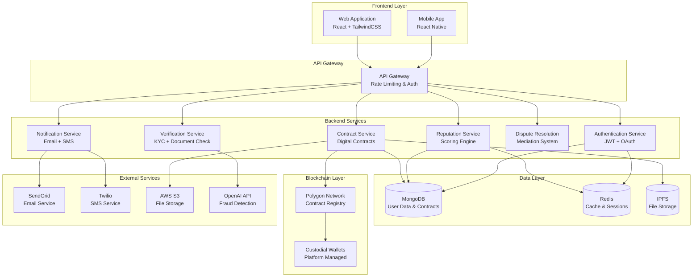
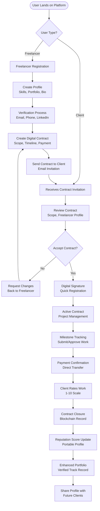
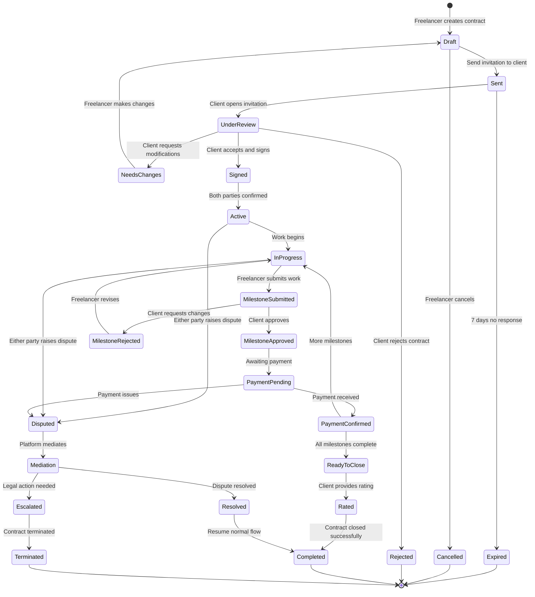
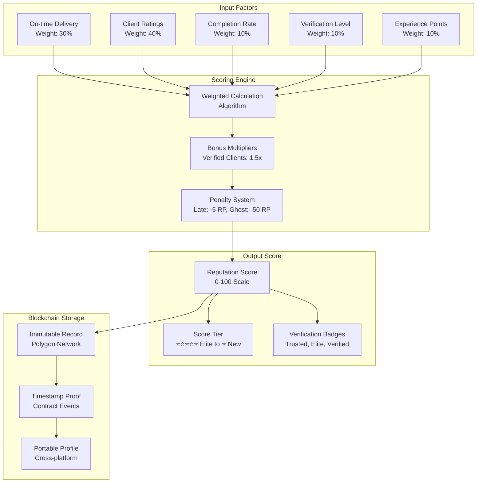
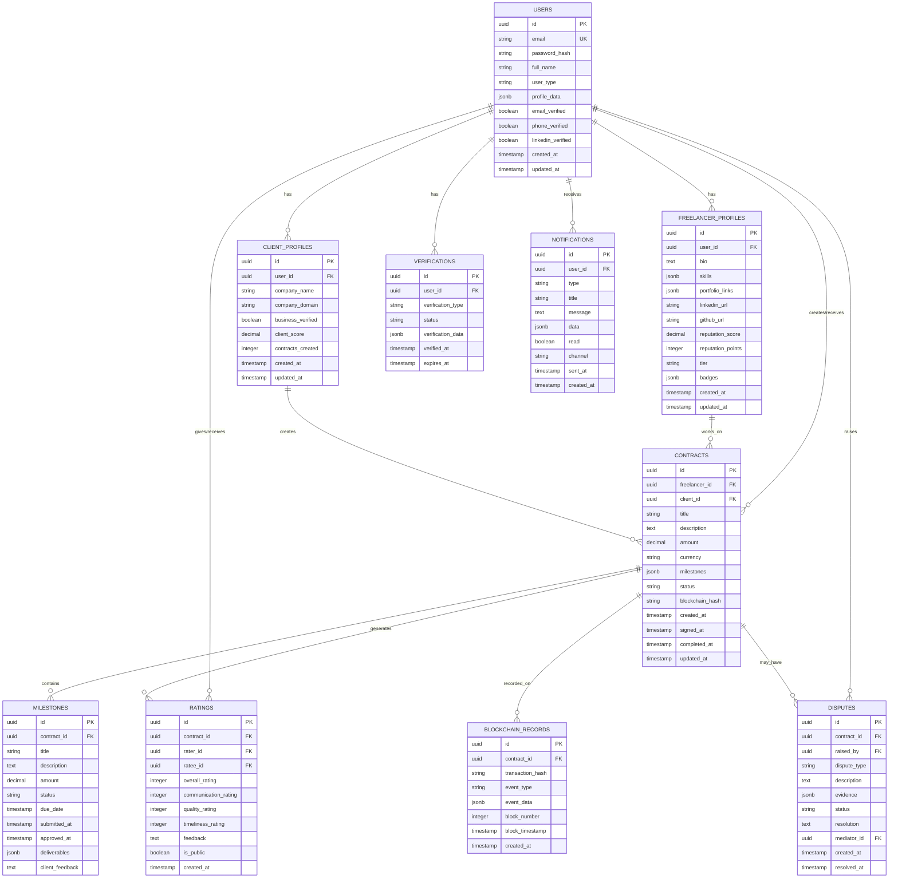
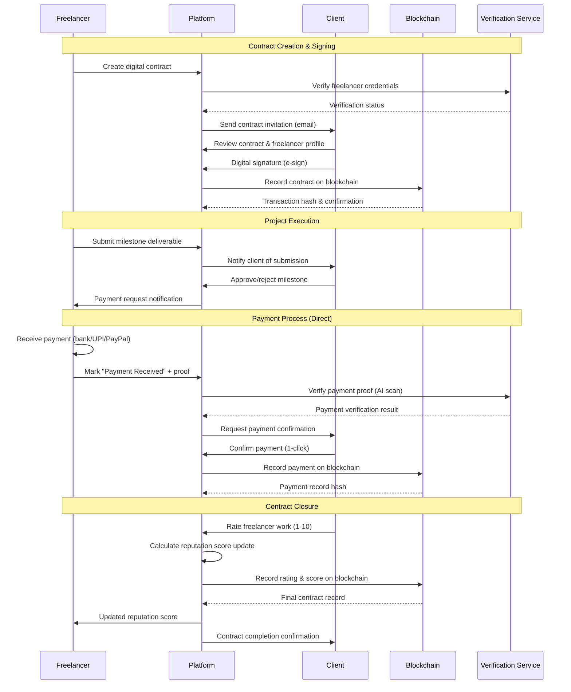
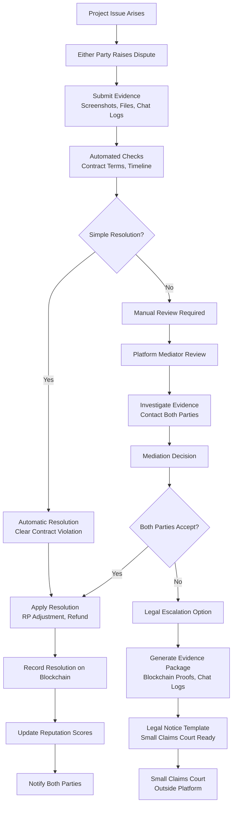
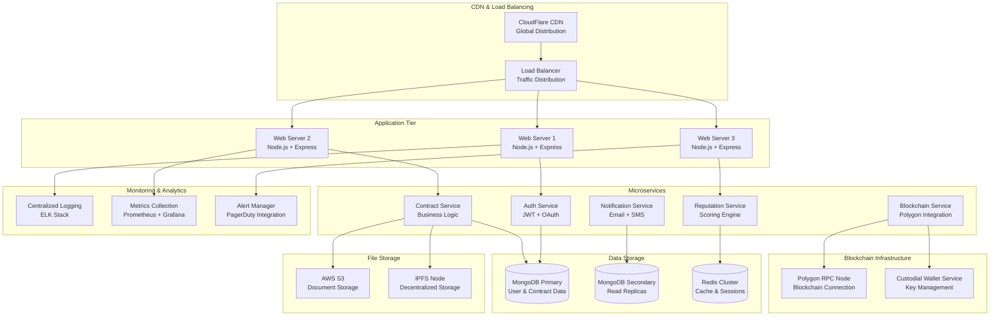

# Decentralized Freelancer Trust Platform - System Architecture Diagrams

## 1. High-Level System Architecture

## 2. User Journey Flow

## 3. Contract Lifecycle State Machine

## 4. Reputation Scoring System

## 5. Database Entity Relationship Diagram

## 6. Payment & Verification Flow

## 7. Dispute Resolution Workflow

## 8. Technical Infrastructure & Deployment

